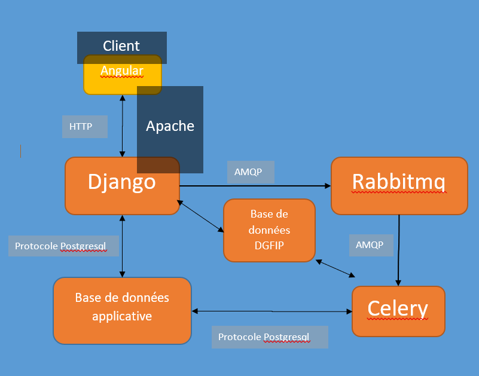

# OpenAnafi
## Présentation
Open Anafi est une refonte de l’application existante sur Business Object, Anafi.
 Cette application a pour but la génération de rapports financiers sur des collectivités publiques.
 Elle s’appuie notamment sur la base DGFIP.
 La base DGFIP est une base contenant tous les comptes ordonnés par exercice des collectivités publiques de France.
 Mais, elle ne s’arrête pas là, elle a pour but à terme de proposer les fonctionnalités suivantes :

* Requêtage assisté de la base DGFIP 
* Création assistée de trame métier (création de formule pour les nouveaux indicateurs)

## Découplement Back & Front

Le projet a été séparé en deux parties distincts:

   * La première étant le projet actuelle, c'est le back-end de l'application: [ici](https://github.com/Cour-des-comptes/open-anafi-backend)
   * La deuxième étant disponible au lien suivant, c'est le front-end de l'application:  [ici](https://github.com/Cour-des-comptes/open-anafi-frontend)

## Architecture

Un serveur faisant tourner l’application Open Anafi est composé de 6 services distincts :
*	**Angular** : partie du code servi par le serveur étant destiné à être exécuté par le navigateur internet du client.
*	**Django** : partie du code étant exécuté sur le directement serveur.
*	**Base de données PostgreSQL**
*	**Rabbitmq** : gestion de queue intergicielle, il permet de faire passer des messages entre Django et Celery via le protocole AMQP
*	**Celery** : il vient exécuter le code python de façon asynchrone et a accède aux mêmes bases de données et contexte que le code exécuté sur par le serveur Django
*	**Apache** : le front et le back (respectivement Angular et Django) sont servies par le serveur apache.

### RabbitMQ
RabbitMQ fonctionne comme un service sur la machine. Il utilise une authentification avec un utilisateur et un mot de passe pour protéger l’envoi et la lecture des messages. De plus, les messages sont liés à un Vhost, ainsi plusieurs Vhost peuvent être utilisés simultanément.
### Celery
Celery fonctionne comme un processus démonisé par le système. On peut donc l’utiliser via l’interface ‘systemctl’. Il permet notamment d’exécuter du code python de façon asynchrone.
### Front et Back
La différence entre le front et le back se fait grâce à l’url que l’on utilise pour contacter la machine. Le serveur Apache donnera accès au Front ou au Back en fonction de celle-ci. 

## Description du projet:
Le projet est rangé de la façon suivante :
* ccomptes/

Ce dossier comporte les configurations du projet, avec notamment toutes les options pour l’utilisation de celery et des différents module django. De plus, il comporte la liste des urls utilitées.
* open_anafi/

Ce dossier comporte la plus grande partie du code.
* open_anafi/lib/
 
Contient tout le code qui peut être utilisé par plusieurs service et permet de le ranger en fonction de son action. Les différentes librairies sont développées sous la forme de classes contenant des méthodes statiques.
* open_anafi/lib/ply/

Ce dossier contient une bonne partie du code utilisé pour le parsing des formules.
* open_anafi/task.py

Ce fichier en particulier contient le code qui sera exécuté par le worker Celery.
* open_anafi/views/

Ce dossier contient les différentes actions qui sont directement exécutées après les liens de l’API. Elles sont découpées par rapports aux différents modèles.
* open_anafi/models.py

Ce dossier contient la définition du modèle de donnée de la base applicative.
* open_anafi/serializers/ 

Ce dossier contient tous les serializers des modèles, en fonction des différents besoins de l’API. Pour rappel, le serializer transforme l’objet Json en objet Python en fonction de règles préalablement fournies.


## Développement avec docker

Prérequis : Installer docker et docker-compose

### Remplir le /opt/local_config.ini

Le fichier de configuration doit par défaut situé dans le dossier /opt/. Cette valeur peut-être modifiée dans le
fichier ccomptes/settings.py ligne 17. Il faudra ensuite reprendre le fichier local_config.ini.sample, le renommer
 puis le completer. 
 
### Construire et lancer l'image docker

Ouvrir un terminal dans le dossier /backend et lancer la commande 'docker-compose up'

Les modifications du code sont automatiquement prise en compte par le serveur Django. 

Cependant Celery n'est pas relancé automatiquement. Pour prendre en compte les modifications du code utilisé par Celery ( i.e. tasks.py et les fonctions appelées par ce fichier ), il est nécessaire d'arreter le container (Ctrl +C) ainsi que de le relancer via la même commande 'docker-compose up'.


## Déploiement sur un serveur CentOs

### Préparation

Mise à jour yum :
```bash
sudo yum -y update
```
Installer outils de compilation:
```bash
sudo yum groupinstall "Development Tools"
```

Installer Python 3 :
```bash
sudo yum -y install https://centos7.iuscommunity.org/ius-release.rpm
sudo yum -y install python36u
sudo yum -y install python36u-devel
sudo yum -y install python36u-pip
sudo yum -y install graphviz
sudo python3.6 -m pip install --upgrade pip

```
### Création utilisateur deploy et du répertoire de déploiement

```bash

sudo adduser deploy
sudo passwd deploy

```
### Installation des dépendances python

Il est recommandé de créer un environnement virtuel dans le repertoire "/opt" :
```bash
pip3.6 install virtualenv
python3.6 -m venv ./venv
```

Installer Apache :
```bash
sudo yum -y install http
sudo yum -y install httpd-devel

```
Installer mod-wsgi:

```bash
sudo yum -y install wget
 wget https://github.com/GrahamDumpleton/mod_wsgi/archive/4.6.4.tar.gz
 tar xvfz 4.6.4.tar.gz

./configure --with-python=/usr/bin/python3.6
make
make install
make clean

```
Redémarrer Apache:
```bash
systemctl restart httpd
```

Configurer Apache:
```bash
cd /etc/httpd/conf.d/

touch backend.conf

```

backend.conf :

ATTENTION: Remplacer les valeurs génériques par les valeurs du serveur (SERVERNAME )

```bash

LoadModule wsgi_module /usr/lib64/httpd/modules/mod_wsgi.so

<VirtualHost *:80>
        AllowEncodedSlashes NoDecode
        ServerName SERVERNAME
        Alias "/graphs" GRAPH_FOLDER

        WSGIPassAuthorization On
        WSGIScriptAlias / /opt/backend/ccomptes/wsgi.py
        WSGIDaemonProcess ccomptes python-home=/opt/venv python-path=/opt/backend
        WSGIProcessGroup ccomptes

        <DirectoryMatch GRAPH_FOLDER>
                Require all granted
        </DirectoryMatch>

        <Directory /opt/backend/ccomptes/>
                <Files wsgi.py>
                        Require all granted
                </Files>
        </Directory>

        ErrorLog /var/log/httpd/backend_api_error.log
        CustomLog /var/log/httpd/backend_api_access.log combined
        LogLevel debug
</VirtualHost>

```

### Génération de clé de deploiement

Générer une clé ssh avec l'utilisateur "deploy"

```bash
su deploy
ssh-keygen
```

Ajouter cette clé au projet GITLAB (clés de deploiements) et à JENKINS

### Donner les droits pour redémarrer apache à l'utilisateur deploy 

ligne 92 (fichier sudoers)
```bash
vim /etc/sudoers 
deploy ALL=NOPASSWD: /sbin/service httpd restart,/etc/init.d/httpd restart,/usr/sbin/apache2ctl restart
```

### Donner les droits pour redémarrer celery à l'utilisateur deploy 

```bash
sudo visudo
```
deploy ALL=NOPASSWD: /sbin/service celery restart,/etc/systemd/system restart

### Import initial du projet

ATTENTION: Remplacer les valeurs génériques par les valeurs du serveur (BRANCH)

```bash
su deploy
cd /opt
git clone -b BRANCH git@gitlabjf.ccomptes.fr:CommunautesJF/OpenAnafi/backend.git
```
### Créer le dossier templates

Créer le dossier templates et lui donner des droits pour tous

```bash
mkdir /opt/backend/openanafi/templates
chmod 777 /opt/backend/openanafi/templates
```

### Charger l'environnement virtuel et installer les dépendances (en sudo) :
```bash
source ./venv/bin/activate
pip install pip --upgrade
cd /opt/backend
pip install -r requirements.txt
```

### Installer le broker Rabbitmq pour la mise en place de celery et du traitement asynchrone des réquètes

#### Prérequis Installation du repo Erlang 

In /etc/yum.repos.d/rabbitmq_erlang.repo

```bash
vi /etc/yum.repos.d/rabbitmq_erlang.repo
[rabbitmq_erlang]
name=rabbitmq_erlang
baseurl=https://packagecloud.io/rabbitmq/erlang/el/7/$basearch
repo_gpgcheck=1
gpgcheck=0
enabled=1
gpgkey=https://packagecloud.io/rabbitmq/erlang/gpgkey
sslverify=1
sslcacert=/etc/pki/tls/certs/ca-bundle.crt
metadata_expire=300
 
[rabbitmq_erlang-source]
name=rabbitmq_erlang-source
baseurl=https://packagecloud.io/rabbitmq/erlang/el/7/SRPMS
repo_gpgcheck=1
gpgcheck=0
enabled=1
gpgkey=https://packagecloud.io/rabbitmq/erlang/gpgkey
sslverify=1
sslcacert=/etc/pki/tls/certs/ca-bundle.crt
metadata_expire=300
yum -y install erlang


```

#### Installation du repo rabbitmq-server pour CentOS

```bash
curl -s https://packagecloud.io/install/repositories/rabbitmq/rabbitmq-server/script.rpm.sh | bash
yum -y install rabbitmq-server
systemctl start rabbitmq-server
systemctl enable rabbitmq-server

```

#### Configuration:

```bash 
rabbitmqctl add_user myuser mypassword
rabbitmqctl add_vhost myvhost
rabbitmqctl set_user_tags myuser mytag
rabbitmqctl set_permissions -p myvhost myuser ".*" ".*" ".*"

```
#### Exemple:

```bash
rabbitmqctl add_user rabbitanafi Choose_your_passwd
rabbitmqctl add_vhost rabbitanafivhost
rabbitmqctl set_user_tags rabbitanafi rbanafi
rabbitmqctl set_permissions -p rabbitanafivhost rabbitanafi ".*" ".*" ".*"
```

#### Installation module celery :

```bash
cd /opt
source ./venv/bin/activate
python3.6 -m pip install celery
```

#### Installation de celery:

Ajouter dans le répertoire /etc/systemd/system/ le fichier celery.service avec le contenu suivant:

```bash
[Unit]
Description=Celery Service
After=network.target

[Service]
Type=forking
WorkingDirectory=/opt/backend/
ExecStart=/opt/venv/bin/celery multi start worker1\
        -A ccomptes -l debug -c 5\
        --pidfile=/var/run/celery.pid\
        --logfile=/var/log/oa-celery.log
ExecStop=/opt/venv/bin/celery multi stopwait worker1 \
        --pidfile=/var/run/celery.pid
ExecReload=/opt/venv/bin/celery multi restart worker1\
        -A ccomptes -l debug -c 5\
        --pidfile=/var/run/celery.pid\
        --logfile=/var/log/oa-celery.log

[Install]
WantedBy=multi-user.target
```

Pour que le system prenne en compte ce nouveau service taper la commande :
```bash
systemctl daemon-reload
```
Si aucune erreur n'a été retournée, vous pouvez maintenant démarrer le service celery :
```bash
systemctl start celery
```
Les logs du processus celery se trouve dans le fichier /var/log/oa-celery.log

Redémarrer httpd.

 
## Remplir le /opt/local_config.ini

Le fichier de configuration doit par défaut situé dans le dossier /opt/. Cette valeur peut-être modifiée dans le
fichier ccomptes/settings.py ligne 17. Il faudra ensuite reprendre le fichier local_config.ini.sample, le renommer
 puis le completer. 


## Créer une base  de test du flux CCI

Dans le dossier ./dump_cci, il faut executer les fichiers SQL 01_CCI_DGFIP_DDL.sql puis tous les fichiers
 contenus dans le dossier 02_CCI_DGFIP_SQL_Donnees_config. Ensuite, vous pouvez importer les dernière données présentes dans 
 les fichiers collectivite.csv et execution_2010.csv grace aux commandes suivantes:
 
 ```bash
COPY execution_2010 FROM 'execution_2010.csv';
COPY collectivite FROM 'collectivite.csv';
```

## Intéraction avec l'API en python

Le script contenu dans le dossier script contient un exemple permettant de communiquer avec le Back End sans passer par 
l'interface graphique. Il permet notamment de lancer plusieurs analyses en même temps.

 ## Ajout d'une nouvelle Trame.
 
 Pour l'ajout d'une nouvelle trame, vous pouvez vous référer au fichier Trame M14 dans le dossiers docs/.
 Il contient des exemples de formule utilisable dans le langage défini dans l'application. Dans le dump_bdd/ 
 vous trouverez un modèles et un paramètrage d'une trame avec les formules des indicateurs.